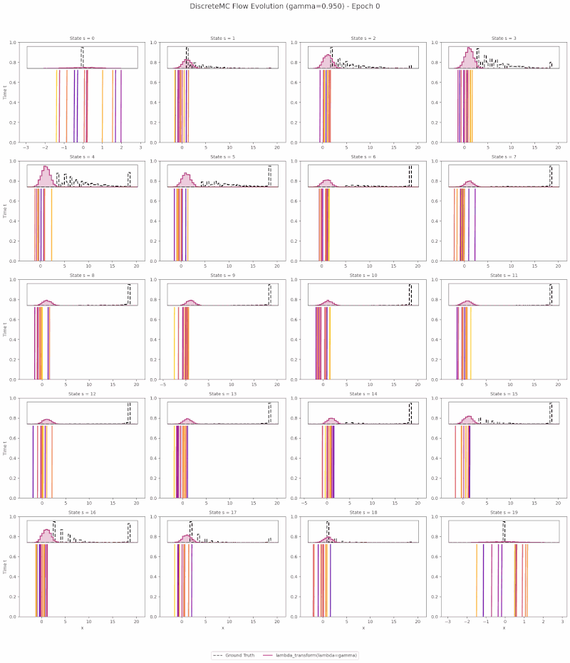


<p align="center">
  <a href="https://arxiv.org/abs/2605.08253"></a>
  <a href="https://github.com/BoyangASU/path-coupled-bellman-flows"></a>
  <a href="https://icml.cc"></a>
</p>

<p align="center">
  
  <br>
  <em><b>Figure 1.</b> Architecture of Path-Coupled Bellman Flows (PCBF). A shared noise variable is propagated along the Bellman path, producing a path-consistent flow-matching objective for return distributions.</em>
</p>

<p align="center">
  
  <br>
  <em><b>Figure 2.</b> Demonstration of the trained agent using Path-Coupled Bellman Flows on Discrete MC Environment.</em>
</p>


## Abstract {#abstract}

Path-Coupled Bellman Flows (PCBF) introduces a flow-based perspective for
distributional reinforcement learning. Rather than treating each return as an
independent sample, PCBF couples the noise along a Bellman trajectory, yielding
a path-consistent flow-matching objective for the return distribution. The
method was accepted as a regular-track paper at ICML 2026.


## Method Overview {#method-overview}

## Key Ideas {#key-ideas}

-   **Distributional flow matching:** Learn return distributions through a
    path-coupled flow objective that aligns the conditional flow with the Bellman
    target.
-   **Shared-noise path coupling:** Propagating a shared noise variable along
    Bellman paths reduces the corrected Bellman residual relative to
    independent-noise baselines.
-   **Variance reduction via control variates:** A $\lambda$-parameterized control
    variate decouples variance reduction from distributional bias and remains
    robust across hyperparameter values.
-   **Stable offline RL training:** PCBF improves optimization stability under
    D4RL and OGBench offline benchmarks, including pixel-based tasks.
-   **Policy extraction:** The learned return distribution is used for downstream
    decision-making and policy selection.


## Toy Environments {#toy-environments}



{{< figure src="figures/toy22.png" alt="CDF comparison on toy environments" caption="<span class=\"figure-number\">Figure 4: </span>Distributional accuracy comparison on toy environments. Learned return CDFs for PCBF and Value Flows (dcfm $\in \{0, 0.5, 1\}$) versus ground-truth references. PCBF tracks the ground-truth CDF more accurately, particularly in high-variance regimes." width="90%" >}}


## Path Consistency {#path-consistency}

{{< figure src="figures/nfe.png" alt="NFE residual comparison" caption="<span class=\"figure-number\">Figure 5: </span>Corrected Bellman residual $r_{\mathrm{corr}}(t, N)$ on Solitaire Dice. Shared-noise PCBF (blue) maintains lower residuals than independent-noise coupling (orange) across diffusion times and function-evaluation budgets." width="80%" >}}


## Offline RL Benchmarks {#offline-rl-benchmarks}




## BibTeX {#bibtex}

```bibtex
@inproceedings{xu2026pathcoupled,
  title={Path-Coupled Bellman Flows for Distributional Reinforcement Learning},
  author={Xu, Boyang and Zou, Qing and Yang, Siqin and Yan, Hao},
  booktitle={Proceedings of the International Conference on Machine Learning},
  year={2026},
  note={ICML 2026 regular track}
}
```
